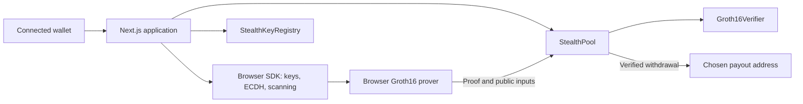
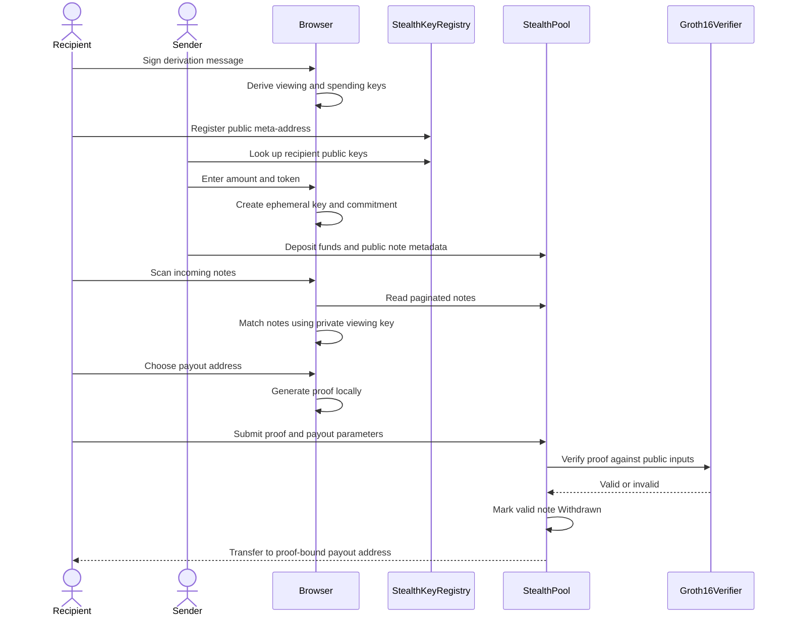

# Stealthy — Private Stablecoin Payments on Arbitrum

> **Arbitrum Open House Singapore Buildathon**
>
> **Get paid in stablecoins. Stay unseen.**
>
> Stealthy is a non-custodial payment application for USDG on Arbitrum. Every deposit creates a one-time stealth commitment. Recipients find their payments locally and claim them with a browser-generated Groth16 proof verified by the smart contract. A separate viewing key enables read-only auditor access without granting spending rights.

**Testnet deployments:** Arbitrum Sepolia · Robinhood Chain Testnet

**Primary asset:** Paxos USDG

**Stack:** Solidity · Circom · Groth16 · TypeScript · Next.js

[Deployments](#deployed-contracts) · [How it works](#3-how-it-works) · [Privacy model](#4-privacy-model) · [Local setup](#11-local-development) · [Demo](#12-demo-walkthrough) · [Tests](#13-testing)

---

## Deployed Contracts

The addresses below come from the repository's [Arbitrum Sepolia deployment record](contracts/deployments/421614.json) and [Robinhood Chain deployment record](contracts/deployments/46630.json).

| Contract | Arbitrum Sepolia · `421614` | Robinhood Chain Testnet · `46630` |
|---|---|---|
| **StealthPool** | [0xFfe0a95A1Ffd486e7f516791d5c63803a88C77b7](https://sepolia.arbiscan.io/address/0xFfe0a95A1Ffd486e7f516791d5c63803a88C77b7) | [0xE474514770C384Cde73AaF618B4118960a0292e8](https://explorer.testnet.chain.robinhood.com/address/0xE474514770C384Cde73AaF618B4118960a0292e8) |
| **StealthKeyRegistry** | [0xEC3671ECE0C62e6BB7a50A4d24b77FF86a4ca7B1](https://sepolia.arbiscan.io/address/0xEC3671ECE0C62e6BB7a50A4d24b77FF86a4ca7B1) | [0x44abd6eB6091e29AC99fAea73891ffDCa5f19944](https://explorer.testnet.chain.robinhood.com/address/0x44abd6eB6091e29AC99fAea73891ffDCa5f19944) |
| **Groth16Verifier** | [0xE474514770C384Cde73AaF618B4118960a0292e8](https://sepolia.arbiscan.io/address/0xE474514770C384Cde73AaF618B4118960a0292e8) | [0xC8F99C4BbcE1Fab1Cf26B0Ef8756283D8a29252E](https://explorer.testnet.chain.robinhood.com/address/0xC8F99C4BbcE1Fab1Cf26B0Ef8756283D8a29252E) |

| Asset | Arbitrum Sepolia | Robinhood Chain Testnet |
|---|---|---|
| USDG | `0xFFC95faa3d63Cde504a05B567C600B78C0b41892` | `0x7E955252E15c84f5768B83c41a71F9eba181802F` |
| USDC | `0x75faf114eafb1BDbe2F0316DF893fd58CE46AA4d` | Not configured |
| ETH | Native asset | Native asset |

**Status:** Testnet software. Not independently audited. Mainnet deployment is a roadmap item.

## 1. What Is Stealthy?

Stealthy adds recipient privacy to stablecoin payments without moving users to another network. Instead of transferring directly to a recipient's everyday wallet, a sender deposits funds into a contract against a fresh cryptographic commitment.

The recipient recognises that commitment using a private viewing key. To release the funds, they prove knowledge of a separate spending key and the payment's shared secret. Neither secret is revealed to the contract.

```text
REGISTER  → Derive viewing and spending keys from a wallet signature.
            Publish the public meta-address in StealthKeyRegistry.

SEND      → Look up the recipient's keys using their ordinary 0x address.
            Create a fresh commitment and deposit USDG into StealthPool.

SCAN      → Read public notes and identify matching payments locally.
            No scanning server receives the private keys.

PROVE     → Generate a Groth16 ownership proof in the browser.
            Bind the proof to a chosen payout address.

CLAIM     → The contract verifies the proof, marks the note spent,
            and transfers the funds to the chosen address.

AUDIT     → Optionally share a read-only viewing key and export payment records.
```

Stealthy hides the recipient association at deposit time from observers without the viewing key or sender knowledge. It does **not** hide payment amounts or provide full withdrawal unlinkability; see the [privacy model](#4-privacy-model).

## 2. The Problem

A public payment address can reveal more than the payment itself. Once that address is associated with a person or business, its transaction history becomes accessible to customers, competitors, colleagues, and strangers.

| User | What a direct payment can expose | Stealthy's use case |
|---|---|---|
| **Freelancers and creators** | Income, other clients, and wallet activity | Receive individual payments without publishing the everyday receiving wallet |
| **Employees** | Salary and subsequent wallet activity | Receive stablecoin compensation through one-time commitments |
| **Businesses** | Supplier relationships and treasury movements | Separate incoming payment recognition from everyday wallet activity |
| **Grant and aid recipients** | A public association between a recipient and funding | Receive funds with optional read-only disclosure to an auditor |

These are target use cases, not claims of established customer adoption. The current product supports individual payments; automated payroll batching is planned.

Manual address rotation requires coordination and additional key management. A separate privacy network requires users to change their payment workflow. Stealthy keeps the payment, escrow, and verification on the selected Arbitrum ecosystem chain.

## 3. How It Works

### One-time commitments

Each payment uses a fresh sender-generated ephemeral key. An ECDH exchange with the recipient's public viewing key produces a shared secret, which is combined with the public spending commitment using Poseidon.

Only someone with the recipient's spending secret can generate the withdrawal proof. The sender knows the shared secret for the payment but cannot spend it.

### A familiar payment flow

| Step | User action | Implementation |
|---|---|---|
| Set up | Connect a wallet, sign the key-derivation message, and register | Keys are derived locally; the public meta-address is registered on-chain |
| Send | Enter a registered recipient address, token, and amount | The browser constructs a note and deposits funds into the pool |
| Receive | Unlock keys and scan | Paginated contract reads are matched locally using ECDH and view tags |
| Claim | Choose a payout address and generate a proof | Browser proving followed by on-chain Groth16 verification |
| Audit | Share a viewing key deliberately | Read-only scanning and CSV export without the spending key |

**USDG permit deposits:** For supported EIP-2612 tokens, `depositWithPermit` combines the token allowance and pool deposit into one on-chain transaction, following a permit signature. Ordinary ERC-20 deposits use approval followed by deposit. ETH deposits use the payable deposit path.

## 4. Privacy Model

Privacy is specific to the recipient association, not every field of a transaction.

| Public on-chain | Kept private by the normal browser flow |
|---|---|
| Sender address, token, and amount | Recipient's viewing and spending secrets |
| Commitment, ephemeral public key, and view tag | Local scanning matches before disclosure |
| Public registry entries | Private witness used to generate a proof |
| Which commitment was withdrawn | Secrets opening the commitment |
| Withdrawal payout address and transaction caller | Association to the recipient's registered identity, unless revealed by transaction behaviour or other information |

### Practical limits

- **Amounts remain visible.** Stealthy is not a confidential-amount system.
- **Withdrawals identify the note.** The current pool uses individually opened commitments, not a Merkle-tree anonymity set.
- **Claiming to a known wallet reveals a link.** A fresh payout address helps avoid that direct association, but does not guarantee anonymity.
- **The transaction caller is public.** Using an identity-linked wallet to submit the claim can reveal the recipient even if the payout address is fresh. Gas funding, timing, and later transfers can also create links.
- **The sender knows whom they intended to pay.** Stealth commitments protect against outside observers; they do not hide the recipient from the sender.
- **Viewing-key disclosure is broad.** A viewing key enables matching incoming notes for that identity, not just one selected receipt. Sharing it cannot revoke previously learned information.

Selective disclosure is an accounting feature. It is not a guarantee of regulatory compliance. Stronger withdrawal unlinkability is a roadmap item.

## 5. Why Zero-Knowledge Matters

The contract must release funds only to someone who knows the secrets opening a specific commitment. Publishing those secrets would destroy the spending-key security model.

Groth16 allows the recipient to prove that knowledge without exposing the private inputs. Verification happens **inside the withdrawal transaction**: a frontend or server cannot authorise a withdrawal by asserting that a proof is valid.

| Layer | Role |
|---|---|
| **ECDH viewing key** | Recognise incoming notes and derive each payment's shared secret |
| **Poseidon spending key** | Keep spending authority separate from scanning authority |
| **Groth16 ownership proof** | Prove knowledge of the secrets opening a note |
| **Public payout inputs** | Bind the proof to the commitment, recipient, relayer, and fee |
| **Contract note status** | Prevent a commitment from being deposited or withdrawn twice |

A proof copied from the mempool cannot be redirected to another payout address or modified to increase the fee. It can still be submitted with its original parameters; funds go to the proof-bound destination.

## 6. Cryptographic Design

### Separate viewing and spending keys

Source: [backend/src/keys.ts](backend/src/keys.ts).

| Value | Construction | Purpose |
|---|---|---|
| `viewPriv` | secp256k1 scalar derived with HKDF-SHA256 | Recognise incoming notes |
| `viewPub` | `viewPriv · G` | Sender's ECDH input |
| `spendPriv` | Independently domain-separated HKDF output reduced to the BN254 field | Private witness for spending |
| `spendPub` | `Poseidon(spendPriv)` | Public spending commitment |

The public meta-address encodes a 33-byte compressed viewing public key and a 32-byte spending commitment. A read-only viewing key contains `viewPriv` and `spendPub`; it does not contain `spendPriv`.

Keys are derived from a wallet signature over the application's fixed derivation message. Restoring the same identity requires the **same signature bytes**, so recovery depends on deterministic signing behaviour. A different wallet implementation or signing method can produce different keys. Treat the derivation signature itself as sensitive because it can reconstruct the keys.

The app holds derived keys in React memory and clears its references when the connected account changes or the user locks the vault. This is not a guarantee of secure memory erasure in JavaScript.

### Sender: create a note

Source: [backend/src/stealth.ts](backend/src/stealth.ts).

```text
r            = fresh random secp256k1 scalar
R            = r · G
S            = r · viewPub
sharedSecret = domain-separated SHA512(compressed S), reduced to the BN254 field
viewTag      = first byte of domain-separated SHA256(compressed S)
commitment   = Poseidon(spendPub, sharedSecret)
```

The sender deposits the token and amount together with `commitment`, `R`, and `viewTag`.

### Recipient: recognise and spend

```text
S'           = viewPriv · R
sharedSecret = derive the same field element from S'
expected     = Poseidon(spendPub, sharedSecret)

If expected equals the published commitment, the note matches.
To withdraw, prove knowledge of spendPriv and sharedSecret.
```

The one-byte view tag filters out most non-matching notes before commitment hashing. ECDH computation is still required to derive the tag.

## 7. ZK Circuit

Source: [circuits/src/stealth_withdraw.circom](circuits/src/stealth_withdraw.circom).

The circuit enforces:

```text
spendPub   = Poseidon(spendPriv)
commitment = Poseidon(spendPub, sharedSecret)
```

| Input | Visibility | Meaning |
|---|---|---|
| `spendPriv` | Private | Recipient's spending secret |
| `sharedSecret` | Private | Secret derived for this specific payment |
| `commitment` | Public | Note being opened |
| `recipient` | Public | Payout address, encoded as an integer |
| `relayer` | Public | Optional fee destination |
| `fee` | Public | Fee in the note's token |

The payout inputs participate in circuit constraints so the proof is bound to their values. The contract checks the note's stored token and amount, recipient validity, and fee bounds separately.

| Component | Implementation |
|---|---|
| Circuit | Circom 2 |
| Proof system | Groth16 over BN254 |
| Commitment hash | Poseidon |
| Browser prover | snarkjs with WASM and zkey artifacts |
| On-chain verifier | Generated Solidity `Groth16Verifier` |
| Setup pipeline | Powers of Tau phase 1, phase-2 contribution, and random beacon |

The current UI self-submits claims with zero relayer and fee. Relayer inputs exist in the circuit and contract; a hosted relayer service is not part of the current application.

## 8. Smart Contracts

### StealthPool — escrow and claims

Source: [contracts/src/StealthPool.sol](contracts/src/StealthPool.sol).

- `deposit`: escrow ETH or an allowlisted ERC-20 against a fresh commitment.
- `depositWithPermit`: combine an EIP-2612 allowance with an ERC-20 deposit.
- `withdraw`: verify a Groth16 proof, consume the note, and pay the bound recipient.
- `getNotes`: return paginated notes for client-side scanning without an indexer.
- `pause` / `unpause`: control new deposits only; existing notes remain withdrawable.

Each note follows `None → Pending → Withdrawn`. Commitments cannot be reused. Amounts are bounded to `uint96`; commitments must be non-zero BN254 field elements. Incoming ERC-20 balance-difference checks reject transfers that do not deliver the expected amount. Rebasing and fee-on-transfer assets are not supported payment assets.

The owner can manage the token allowlist and pause deposits. There is no owner withdrawal method, and the verifier address is immutable.

### StealthKeyRegistry — recipient discovery

Source: [contracts/src/StealthKeyRegistry.sol](contracts/src/StealthKeyRegistry.sol).

The registry implements the ERC-6538 interface for publishing meta-addresses. Senders can look up a recipient using an ordinary wallet address. EIP-712 signed registration on behalf of a recipient is supported by the contract; paymaster-based onboarding is planned.

### Groth16Verifier — proof verification

Source: [contracts/src/Groth16Verifier.sol](contracts/src/Groth16Verifier.sol).

The generated verifier checks the proof against the four public signals. `StealthPool` calls it before releasing funds. Changing the circuit or proving key requires a matching verifier deployment.

The contracts use OpenZeppelin 5.4 components including `Ownable2Step`, `Pausable`, `ReentrancyGuard`, `SafeERC20`, `EIP712`, and `SignatureChecker`. Library use does not replace an independent audit.

## 9. Architecture and Payment Sequence



Despite its folder name, **`backend/` is a client-side TypeScript SDK, not an HTTP API server**. Key derivation, scanning, and proving run in the browser. RPC providers receive contract reads and submitted transactions, not the private proving witness through the application's normal flow.



## 10. Repository Structure

```text
Arb/
├── backend/                  Client-side TypeScript SDK
│   ├── src/                  Keys, commitments, scanning, proof formatting
│   ├── scripts/              Real-proof fixtures and fork E2E flow
│   └── test/                 SDK and circuit proving tests
├── circuits/
│   ├── src/                  stealth_withdraw.circom
│   └── scripts/              Circuit compilation and setup pipeline
├── contracts/
│   ├── src/                  Pool, registry, and generated verifier
│   ├── script/               Foundry deployment script
│   ├── deployments/          Chain-specific deployment records
│   └── test/                 Contract tests, mocks, and proof fixtures
├── frontend/
│   ├── app/                  Landing, Send, Receive, Prove, History, Audit
│   ├── components/           Wallet controls and UI components
│   ├── lib/                  Chains, contracts, keys, scanning, proving
│   ├── public/circuits/      Browser proving artifacts
│   └── scripts/              ABI, deployment, and snarkjs synchronisation
└── README.md
```

The UI uses a black-and-white theme, Instrument Serif headings, DM Sans body text, and receipt cards to explain public versus stealth payments.

## 11. Local Development

### Prerequisites

- Node.js 20+ and npm.
- Foundry (`forge`, `cast`, and `anvil`) for contract builds, tests, and deployment.
- An EVM wallet supporting the configured testnets.
- Testnet ETH for registration, deposits, and withdrawal transaction gas.

A native Circom installation is optional: the circuit build script falls back to the npm `circom2` compiler. On Windows, use a Foundry-supported shell or WSL for Foundry commands.

### Install

```bash
git clone https://github.com/theyuvan/Arb.git
cd Arb
npm --prefix backend install
npm --prefix circuits install
npm --prefix contracts install
npm --prefix frontend install
```

### Build contracts and start the app

```bash
cd contracts
forge build
cd ../frontend
npm run dev
```

Open **http://localhost:3000**. There is no separate backend process to start.

The frontend's `predev` and `prebuild` scripts synchronise contract ABIs, deployment records, and the snarkjs browser bundle. Production builds first install the linked SDK's locked production dependencies in `backend/`, so frontend-only hosting installs can resolve its cryptography packages. This removes SDK development dependencies locally; run `npm --prefix backend ci` before running SDK tests again. Existing ABI files can be used when Foundry output is absent. Browser proving also requires the matching WASM and zkey files in `frontend/public/circuits/`.

### Vercel configuration

Set the project Root Directory to `frontend`, use the Next.js preset, and leave the Build Command as `npm run build`. Enable access to files outside the Root Directory so `../backend` and `../contracts` are available. The build installs the SDK dependencies before compiling the app; do not bypass `prebuild` with a direct `next build` command.

### Optional RPC configuration

Create `frontend/.env.local` to override the default endpoints:

```dotenv
NEXT_PUBLIC_ARBITRUM_SEPOLIA_RPC=https://sepolia-rollup.arbitrum.io/rpc
NEXT_PUBLIC_ROBINHOOD_TESTNET_RPC=https://rpc.testnet.chain.robinhood.com
```

Values prefixed with `NEXT_PUBLIC_` are exposed to the browser. Use only provider credentials intended for public client access.

### Production build

```bash
npm --prefix frontend run build
npm --prefix frontend run start
```

### Rebuild the circuit only when needed

```bash
npm --prefix circuits run build
npm --prefix backend run fixtures
```

This pipeline compiles the circuit, downloads the phase-1 Powers of Tau file when absent, performs phase 2, verifies the resulting zkey, and exports the Solidity verifier and browser artifacts.

**Rebuilding generates a new proving key.** Existing deployed verifiers will not match the new artifacts. Redeploy the matching verifier and pool, then synchronise deployment records before using the rebuilt app with them.

### Deploy contracts

Run from `contracts/`, using an encrypted Foundry keystore:

```bash
cast wallet import deployer --interactive
forge script script/Deploy.s.sol --rpc-url https://sepolia-rollup.arbitrum.io/rpc --account deployer --broadcast
forge script script/Deploy.s.sol --rpc-url https://rpc.testnet.chain.robinhood.com --account deployer --broadcast
```

Then, from the repository root:

```bash
npm --prefix frontend run sync
```

Deployment records are read from `contracts/deployments/<chainId>.json`. Keep these records consistent with the contracts and proving artifacts used by the app.

## 12. Demo Walkthrough

Use two wallets on the same configured testnet: one recipient and one sender. Both need ETH for their transactions; the sender also needs the payment token.

1. **Register:** Connect the recipient wallet and open `/receive`. Sign the derivation message and register the public keys on-chain.
2. **Send:** Connect the sender wallet and open `/send`. Enter the registered recipient's ordinary wallet address, choose USDG, and send a test payment. Sign the permit and deposit transaction as prompted.
3. **Scan:** Reconnect the recipient wallet, unlock its keys, and scan in `/receive`. The app matches the note locally.
4. **Prove:** Open the claim flow in `/prove`, choose the payout address, and generate a proof in the browser.
5. **Claim:** Submit the withdrawal transaction. Show the proof verification and payout in the chain explorer.
6. **Audit:** Open `/audit` with a deliberately shared viewing key. Show incoming-note discovery and CSV export without spending authority.
7. **Explain the boundary:** Show that the amount and withdrawn commitment remain public. The claim caller is also visible, so a fresh payout address alone does not guarantee unlinkability.

Faucet links configured by the application:

| Network | ETH | Stablecoins |
|---|---|---|
| Arbitrum Sepolia | [Arbitrum faucet](https://arbitrum.faucet.dev/) | [Paxos USDG faucet](https://faucet.paxos.com/) · [Circle USDC faucet](https://faucet.circle.com/) |
| Robinhood Chain Testnet | [Robinhood Chain faucet](https://faucet.testnet.chain.robinhood.com/) | [Paxos USDG faucet](https://faucet.paxos.com/) |

## 13. Testing

The repository includes SDK tests, real-circuit proving tests, Foundry contract tests, and a fork-based end-to-end script. Run them to reproduce results for your environment rather than relying on a fixed count or benchmark.

```bash
npm --prefix backend test
npm --prefix backend run typecheck
npm --prefix frontend run typecheck
cd contracts
forge test -vv
```

| Suite | Coverage |
|---|---|
| SDK | Signature-derived keys, encoding, ECDH notes, scanning, viewing keys, and private-key restoration |
| Circuit | Valid proof verification, altered public inputs, and inability to spend using sender knowledge alone |
| Pool | Real-proof withdrawals, replay rejection, payout binding, permits, accounting, pause behaviour, and fuzz cases |
| Registry | Registration, authentication, and signed registration behaviour |
| Fork E2E | Registration → real USDG permit deposit → scan → proof → withdrawal, plus ETH claims and double-claim rejection |

### Fork end-to-end flow

Use a local Anvil fork, not a public RPC endpoint: the script uses local test-node capabilities. The commands below use Bash/WSL environment-variable syntax.

Start Anvil in one terminal:

```bash
anvil --fork-url https://sepolia-rollup.arbitrum.io/rpc --chain-id 421614
```

In another terminal, from `contracts/`, deploy using the local Anvil test account's private key only:

```bash
DEPLOYMENT_OUT=deployments/fork-421614.json forge script script/Deploy.s.sol --rpc-url http://127.0.0.1:8545 --private-key <ANVIL_TEST_PRIVATE_KEY> --broadcast
```

Then run from `backend/`:

```bash
RPC_URL=http://127.0.0.1:8545 DEPLOYMENT=../contracts/deployments/fork-421614.json npx tsx scripts/e2e.ts
```

The script also supports a Robinhood Chain fork using chain ID `46630` and the corresponding deployment record. Fork broadcasts can share a directory with public-chain broadcasts when chain IDs match; keep local fork output separate from the records used for published deployments.

## 14. Security and Trust Assumptions

| Property | Mechanism and boundary |
|---|---|
| **Non-custodial escrow** | No admin fund-withdrawal path; withdrawals require verifier acceptance |
| **Single-use notes** | Contract status prevents repeated deposits and claims for the same commitment |
| **Bound payout** | Commitment, recipient, relayer, and fee are public proof inputs |
| **Separate audit authority** | Viewing key recognises notes but lacks the spending pre-image |
| **Local secret handling** | Browser flow derives keys and generates witnesses without an application key server |
| **Pause scope** | Admin pause blocks new deposits, not withdrawals |
| **Token accounting** | Token allowlist, amount bounds, and incoming balance-difference checks |
| **Permit resilience** | Permit failure is tolerated when allowance is already sufficient, including a consumed permit nonce |

**Browser trust:** A compromised application build, malicious extension, or compromised device can steal secrets. Local proving removes a proving-server dependency; it does not remove the need to trust the code running on the device.

**Signature-derived recovery:** Preserve access to the signing wallet and its deterministic signing behaviour. The exported full meta private key and derivation signature both carry spending authority; a viewing key carries financial disclosure authority.

**Trusted setup:** The build pipeline uses the PSE perpetual Powers of Tau phase-1 artifact followed by a local phase-2 contribution and beacon. A beacon does not replace independent phase-2 participants. Mainnet readiness requires a reviewed multi-party setup ceremony and an independent audit.

## 15. Buildathon Fit

Based on the supplied Arbitrum Open House Singapore brief:

| Judging consideration | Repository implementation |
|---|---|
| **Arbitrum ecosystem deployment** | Deployment records for Arbitrum Sepolia and Robinhood Chain Testnet |
| **Smart contract quality** | Explicit invariants, OpenZeppelin components, real-proof tests, replay protection, and fuzz cases |
| **Product-market fit** | A concrete workflow for freelancers and stablecoin compensation, with read-only accounting access |
| **Innovation and creativity** | Scan/spend separation, stealth commitments, and browser-generated proofs verified on-chain |
| **Real problem solving** | Reduce public recipient-wallet exposure while retaining familiar payment addresses |
| **USDG integration** | USDG configured on both testnets, including EIP-2612 permit deposits |

The implementation uses **Solidity today**. Stylus optimisation is planned, not claimed as an existing integration. Target users and market fit remain hypotheses to validate through pilots.

## 16. Roadmap

1. **Payroll batches:** Pay multiple recipients through a coordinated batch workflow.
2. **Shielded withdrawals:** Explore Merkle-tree commitments and nullifiers to avoid publicly identifying the opened note, alongside association-set disclosure mechanisms.
3. **Stylus optimisation:** Evaluate a Rust/Stylus verifier and Poseidon implementation with measured gas comparisons.
4. **Gasless onboarding and claims:** Add paymaster and relayer integrations beyond the current contract primitives.
5. **Pilot validation:** Test recipient onboarding, recovery, audit exports, and repeat use with freelancers and payroll teams.
6. **Mainnet readiness:** Independent audit, multi-party phase-2 ceremony, and operational review before deployment to Arbitrum One or another production chain.

## License

Package manifests declare **MIT**.

---

*Built for Arbitrum Open House Singapore · USDG payments · Browser-generated proofs · On-chain verification*
